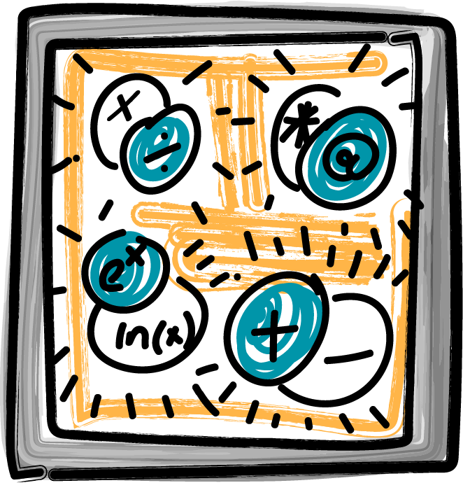

# 传音筒、"name"和“process”

## 消息传递

在前面的章节，我们学习了如何向祖母或披萨店发送消息。但是至今所有的接收方都通过将消息打印至标准输出，来告知已经接收到了。

现在让我们做一些更有意思的事情--类似孩子们的传话游戏那样传递消息。

[telephone3.rho](telephone3.rho)

你可以通过运行上面的代码来做实验。你可以修改你觉得合适的地方多运行几次。

### 练习

传话游戏很有趣，但有更多玩家参与会更好。请添加第三位明教Charlie的玩家。bob接收消息后将发送消息给Charlie，而不是简单打印至`stdout`。然后Charlie将它打印至屏幕上。多多益善!

### 练习
如果你曾经玩过电话游戏，你应该知道，消息极少能被正确地传递。Bob现在决定通过发送一条错误的消息。改写程序，使得Bob无论收到什么，都能传递不同的消息。

## *这到底是啥？

你注意到 `@"Bob"!(*message)`中的`*`? 在rholang中有两种类型， "names" 和 "processes"。同样也有可以在两者之间互相转化的方法。

<!-- TODO: Maybe an illustration of arrows labeled * and @ would be better here? -->

"processes"可以是rholang中任何一个代码片段，例如我们的传话筒游戏，或者是披萨店订单程序。“process”可以是上百行的大程序，也可以只有几行。它们甚至可以是用于表示值的代码。下面是一些“process”的例子。

 - `stdout!("Sup Rholang?")` 一个常见的发送操作。
 - `Nil` 最小的“process”。如字面意思，它不做任何事。
 - `for(msg <- @"phone"){Nil}` 一个常见的接收操作，在消息到达时它不会做任何事。
 - `"Hello World"` 另一个不做任何事请的小“process”。被称为"基础术语"。

"names"可以被用于赋名通道以发送消息。在大多数编程语言中，"name"是完全独立的一样东西，它们本身就存在。但是在rholang中，"name"来自"引用process"，即将@标签放在“process”之前，即可得到一个"name"。下面是"name"的一些例子。

 - `@"Hello World"` 通过引用基础术语"Hello World"来创建。
 - `@Nil` 最小的“name”。通过引用最小的“process”来创建。
 - `@(@"Alice"!("I like rholang, pass it on."))` 通过引用来自传话筒游戏的"process"来创建。

## 关于*的一切

通过用`@`符号来标记“process”，我们可以将“process”打包以创建一些“name”。我们也可以通过使用`*`标记“name”，从而将“name”转变为“process”。

在rholang中，我们需要记住的是<strong>发送“process”和接收“name”</strong>。这很重要，因此我再次强调。你总是<strong>发送一个“process”</strong>，在另一端<strong>接收一个“name”</strong>。

Aice通过`for(message <- @"Alice")`接收我们的消息，所以， `message` 变成了一个“name”。当她之后发送给Bob时，她不得不发送“process”，所以她要用`@"Bob"!(*message)`使用`*`将`message`转变回一个“process”。

## 小测验

我们发送什么？
- [x] processes
- [ ] names

我们接收什么？
- [ ] processes
- [x] names

`@"registration"`是什么？
- [ ] process
- [x] name
- [ ] 非法语法

`Nil`是什么?
- [x] process
- [ ] name
- [ ] 非法语法

`@Nil`是什么?
- [ ] process
- [x] name
- [ ] 非法语法

`@@Nil`是什么?
- [ ] process
- [ ] name
- [x] 非法语法

`*importantData` 是一个“process”, 那么`importantData`是什么?
- [ ] process
- [x] name
- [ ] 非法语法

下面哪一个与`"BobsPhone"`等价?
- [x] `*@"BobsPhone"`
- [ ] `@"BobsPhone"`
- [ ] `*"BobsPhone"`
- [ ] `@*BobsPhone`
- [ ] `stdout!("BobsPhone")`

### 练习

不像之前的线性传话游戏那样，每个玩家将信息传递给下一位，我么来为游戏添加一个分支。现在，Bob与先前一样将发送消息给Charlie，但同时也会发送给Elise。

每个分支的长度由你定，但在每个分支的最后都得将消息打印至标准输出。
