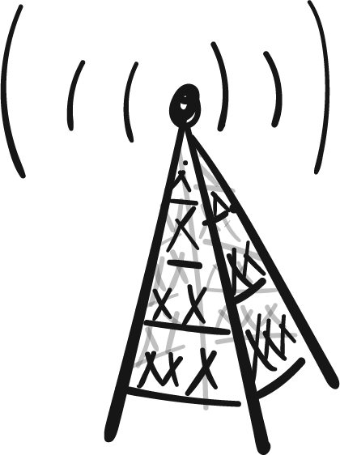

# Персистивная отправка и Подглядки

## Зачем нужна постоянная отправка?

Наша пиццерия и кофейня хотели получать множество сообщений по одному и тому же каналу. Мы добивались этого при помощи персистивного for `for (msg <= chan){...}` или контракта `contract chan(msg){...}`.

Башне авиадиспетчеров нужно что-то полностью противоположное -- отправлять одно и то же сообщение снова и снова. Диспетчеры в башне хотят записать сообщение с информацией о погоде и состоянии взлетной полосы единожды и доставлять его любому и каждому пилоту, который в нем заинтересован. Как и работники пиццерии, диспетчеры -- занятые люди и не могут себе позволить переотправлять сообщение каждый раз, когда пилот его поглотит.

## Синтаксис персистивной отправки

Диспетчерской башне нужно внести небольшую правку в свой код, чтобы сделать отправку постоянной. Вместо того, чтобы использовать один восклицательный знак `!`, они будут использовать двойной `!!`.

[persistentSend.rho](persistentSend.rho)

Убедитесь сами, что изначальное сообщение всё ещё находится в пространстве кортежей, в хранилище. 

### Упражнение
Измените код, приведенный выше, так, чтобы второй пилот тоже получил инфорцию о взлетной полосе и погоде. Убедитесь, что отправленное сообщеие всё ещё находится в хранилище. 

Кстати, вы обратили внимание, что нам не нужна строчка `new stdout(...) in {}`, если мы не используем стандартный вывод? Измените код так, чтобы пилоты подтверждали получение сообщения, выводя его на `stdout`.

### Тест
Сколько комм-событий произойдет при выполнении `for (x <- y) {Nil} | y!!(Nil)`
- [x] `1`
- [ ] `много`
- [ ] `0`

Сколько комм-событий произойдет при выполнении `for (x <= y) {Nil} | y!!(Nil)`
- [ ] `1`
- [x] `много`
- [ ] `0`

## Перепроверка сообщения

Персистивная отправка и получение могут оказаться очень полезными, как мы только что показали. Но часто можно обойтись обычными операторами отправки и получения. Представьте, что я отправил своей бабушке письмо, и она его получила. 

[grandma.rho](grandma.rho)

Теперь представьте, что я хочу удостовериться, что точно сообщил ей правильное время встречи. Я мог бы поглотить сообщение, но тогда бабушка его уже никогда не получит. 

### Упражнение
Используя уже имеющиеся у вас знания, вы можете поглотить сообщение, проверить его правильность, а затем отправить то же сообщение обратно на старый канал. 

Попробуйте написать код для этого сами. Решение приведено ниже. Но вы ничему не научитесь, если будете постоянно подглядывать. 

### Решение упражнения

[grandmaCheck.rho](grandmaCheck.rho)

## Синтаксис для подглядок

В ро будет специальный синтаксис для посмотра сообщений. Сейчас он пока не работает, но его реализация не за горами. Этот синтаксис позволяет прочитать сообщение на канале, не поглощая его. Для этого используется оператор `<!`.

[peek.rho](peek.rho)

Доступ к данным без их поглощения вам уже знаком, если вы сталкивались к электронными таблицами вроде Экселя. В таком макросе `for (value <! A1) { ... }` данные из ячейки А1 не стираются и не модифицируются, однако их можно использовать для каких-нибудь вычислений.

### Тест

Какой синтаксис используется для того, чтобы подсмотреть сообщение?
- [x] `for (x <! y){...}`
- [ ] `for (x <= y){...}`
- [ ] `x!!(y)`

Сколько комм-событий произойдет при выполнении `for (x <! y) {Nil} | y!!(Nil)`
- [x] `1`
- [ ] `many`
- [ ] `0`
