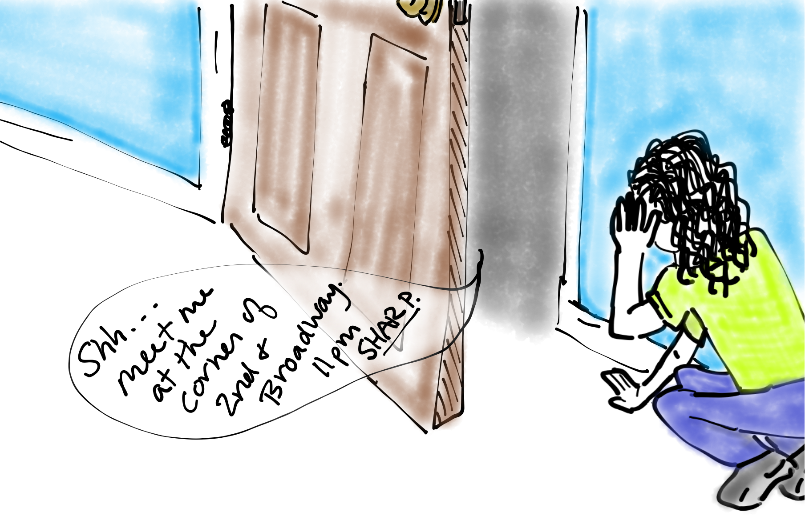

# Неподделываемые имена и подтверждения

## Делаем каналы "Приватными"


Пока что у каждого канала, по которым мы посылали сообщения было общедоступное, публичное имя вроде `@"pizzaShop"`. Любой может послать сообщение на этот канал (это хорошо для бизнеса), но и любой может получать сообщение по этому каналу (а это уже катастрофа для бизнеса). Представьте, если конкуренты будут поглощать заказы на пиццу, и сама пиццерия их никогда не получит.

Какой код нужно написать недобросовестному конкуренту, чтобы перехватывать заказы?
- [ ] `contract evilPizzaShop(interceptedMessage) = {Nil}`
- [ ] `@"evilPizzaShop"!("pizzaShop")`
- [ ] `@"pizzaShop"!("intercept")`
- [x] `for (interceptedMessage <- @"pizzaShop"){...}`

## Ограниченные и Свободные Имена

Мы уже знаем, как получать сообщения с помощью `for` и `contract`. Обе эти конструкции "привязывают" или ограничивают область доступа к именам. Например, `order` является ограниченным именем в нашем коде для кофейни.

[bound1.rho](bound1.rho)

Это также верно в тех случаях, когда мы используем `contract`.

[bound2.rho](bound2.rho)

Имя считается ограниченным, если оно существует только внутри какого-либо конкретного процесса и к нему нельзя получить доступ за его пределами. Имя `order` является ограниченным к коде кофейни. С другой стороны, любое имя, к которому можно получить доступ как-то ещё является свободным. `@"coffeeShop"` в приведенных выше примерах является свободным.

Укажите, является ли `x` ограниченным или свободным именем в следующих примерах:

`for (x <- y){Nil}`
- [x] Ограниченное
- [ ] Свободное
- [ ] Ни то, ни другое

`for (y <- x){Nil}`
- [ ] Ограниченное
- [x] Свободное
- [ ] Ни то, ни другое

`new x in { x!(true) }`
- [x] Ограниченное
- [ ] Свободное
- [ ] Ни то, ни другое

`contract x(y) = { Nil }`
- [ ] Ограниченное
- [x] Свободное
- [ ] Ни то, ни другое

`contract y(x) = { Nil }`
- [x] Ограниченное
- [ ] Свободное
- [ ] Ни то, ни другое

`for (y <- @"x"){Nil}`
- [ ] Ограниченное
- [ ] Свободное
- [x] Ни то, ни другое

## Оператор `new`
Конструкции с `for` и `contract` идеально ограничивают имена в рамках процесса. Но что будет, если мы захотим создать ограниченное имя, на которое можно отправлять сообщения? Например, нашей пиццерии важно, чтобы направленные для нее сообщения не перехватывали. Мы решаем эту проблему при помощи оператора `new`.

[newPizzaShop.rho](newPizzaShop.rho)

Прежде всего отметим, что `pizzaShop` является именем, хотя оно и не начинается со знака `@`. Оператор `new` создал это имя напрямую, а не цитируя какой-либо прописанный процесс. Когда мы создаем имя с помощью `new`, то оно всегда будет ограниченным.

Кроме того, заметим, что такой подход не только защищает заказы нашей пиццерии от конкурентов, но и запрещает новым клиентам делать заказы. Мы справимся с этой проблемой в уроке про связки (bundles).

Что происходит, когда мы пытаемся заказать пиццу вне ограничений, заданных `new` restriction?
- [ ] Заказ проходит без проблем
- [ ] Заказ проходит, но для этого требуется больше времени
- [x] Возникает ошибка с объявлением свободных переменных высшего уровня
- [ ] Код исполняется, но заказ не доходит до получателя

Мы знаем, что все имена цитируют процессы. А какой процесс цитирует имя `pizzaShop`? Попробуйте вывести этот процесс на `stdout`, чтобы выяснить это.
- [ ] Оно цитирует "pizzaShop"
- [ ] Оно ничего не цитирует
- [x] "Какое-то неподделываемое шестнадцатеричное число" 

## Приватные и неподделываемые имена: в чем разница? 



Ключевое слово `new` также известно как оператор ограничения, потому что он ограничивает использование имён в пространстве, обёрнутом в фигурные скобки, или в своей области действия идентификатора. В мире ро эти новые имена действительно видны только в своей области. Но помните, что люди-программисты могут смотреть на этот мир снаружи. Это важно чётко представлять себе особенно в контексте работы с блокчейном, который доступен для всех участников сети. 

И хотя конкуренты пиццерии можно не могут _поглощать_ заказы, направленные в наше заведение, они всё ещё могут считывать заказы при помощи программы-просмотрщика блоков. Часто программисты называют имена, созданные при помощи`new` "приватными", но лучше называть их "неподделываемыми", чтобы лучше понимать их свойства.

В предыдущих уроках мы использовали `new`, чтобы не допустить захламления хранилища (пространства кортежей). Почему использование неподделываемых имен бережет хранилище от мусора и позволяет нам не обнулять пространство кортежей после каждого запуска контракта?
- [ ] Потому что `new` создает свободные имена
- [x] Потому что `new` создает неподделываемые имена, к которым нельзя обратиться за пределами кода 
- [ ] Потому что `new` автоматически очищает хранилище

## Каналы подтверждения


Один из самых распространенных способов использования неподделываемых имён - так называемые "каналы подтверждения" ("acknowledgement channels" или просто"ack" каналы). Вместо того, чтобы подтверждать заказы, выводя их на экран и беспокоя _всех_, пиццерия должна сообщить только _клиенту_, что заказ получен.

Для этого пиццерии нужно знать, как связаться с клиентом. Поэтому клиенту надо предоставить канал для подтверждения. Традиционно такой канал называется `ack`.

[pizzaAck.rho](pizzaAck.rho)

Почему подтверждения в предыдущем примере не появляются на экране?

- [ ] В коде ошибка
- [ ] Заказы не были получены должным образом
- [x] Подтверждение не было отправлено на канал `stdout`

### Упражнение
В предыдущем примере хранилище засоряется на каналах `@"Alice"` и `@"Bob"`. Исправьте это, дав Алисе и Бобу неподделываемые имена.

## Отправка имен предоставлят разрешения
Как мы только что видели, клиент может дать пиццерии канал для подтверждения получения заказа. Сейчас на этот канал может написать кто угодно. Любой другой код может отправить на канал подделанное сообщение о том, что заказ принят, хотя в действительность это может быть и не так. Но мы можем это исправить. Алисе и Бобу нужно строго следить за своими неподделываемыми именами, потому что разглашение кому-либо этого имени дает возможность связаться с вами.

[privateAck.rho](privateAck.rho)

Решение проблемы заключается в том, чтобы создать новое неподделываемое имя и передать его только пиццерии, которая будет единственным агентом, который сможет с ними связаться. И хотя пиццерия находится _вне_ области видимости `new alice`, она может посылать сообщения на этот канал, потому что Алиса назвала его неподделываемое имя. Это замечательный способ делегирования привилегий.

В этом примере мы доверяем пиццерии только _отправлять_ сообщения на канал подтверждения. Но, при желании, она может и получать сообщения на канале подтверждения. Мы научимся передавать привилегии частично в уроке про связки.

Боб тоже хочет заказать пиццу и дать неподделываемый канал подтверждения. Где ему надо создать этот канал?
- [x] На своей строчке, после кода Алисы
- [ ] На той же строчке, где и Алиса
- [ ] В самой первой строчке кода программы

## `stdoutAck` и `stderrAck`

Теперь, когда мы понимаем, что такое каналы подтверждения, нам следует узнать об ещё двух способах вывести текст на экран. Это можно сделать при помощи каналов `stdoutAck` и `stderrAck`. Они работают также как их родственники из первого урока, но они также обладают каналами подтверждения.

[stdoutAck.rho](stdoutAck.rho)

Кстати, вы замечали несколько сообщений, которые всегда появляются даже в очищенном хранилище? Четыре из них относятся к каналам стандартного вывода. Остальные - используются для криптографии. Мы обсудим их позднее.


### Упражнение
`stdout!("1")|stdout!("2")|stdout!("3")`
Обратите внимание, что эта программа выводит числа в случайном порядке. Вызовы происходят одновременно. Представьте, что нам очень важно, чтобы эти строчки выводились по порядку. Измените код, используя каналы подтверждения, чтобы быть уверенным в нужной последовательности вывода.

### Упражнение
Сделайте предположение о результатах работы этой программы (что она передаст на выход и что будет поглощено в хранилище). Затем запустите ее, чтобы проверить свой прогноз.
```
new myChan in {
  myChan!("Hi There")
}
|
for (msg <- myChan) {stdout!(*msg)}
```

Если вы ошиблись в своих прогнозах, то измените программу так, чтобы она действительно делала то, на что вы рассчитывали.


## Тест

Какое имя является ограниченным в выражении `for(x <- y){Nil}` ?
- [x] `x`
- [ ] `y`
- [ ] `Nil`


Какое имя является ограниченным в выражении `new x in {Nil}` ?
- [x] `x`
- [ ] `y`
- [ ] `Nil`


Если `pizzzaShop` - это имя, то что тогда `@pizzaShop`?
- [ ] Имя
- [ ] Процесс
- [x] Синтаксическая ошибка


Почему в коде pizzaShopAck `"bob"` используется как канал подтверждения, а не `@"bob"`?
- [ ] Причины нет, это стилистическое предпочтение.
- [x] Потому что @"bob" - это имя, а мы можем отправлять только процессы.
- [ ] Потому что для каналов подтверждения предусмотрен специальный синтаксис.
