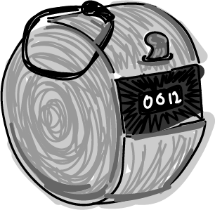

# 状态通道

## 保存数据


到现在为止，你已经很擅长于发送数据到元组空间和从元组空间中获取数据。但是无论你在什么时候进行计算，你有时需要把一些数据放在一边晚点才使用。几乎所有编程语言都有变量的概念。

rholang 的另一个独特的地方在于它没有传统的变量。然而，我们只是使用元组空间来保存我们的数据。只要你想要把一些数据放在一边晚点使用，就把数据发送到一些通道里然后晚点再从通道中获取。以这种方式使用的通道叫做"状态通道",通常我们会在状态通道名字末尾用`Ch`

[box.rho](box.rho)


什么数据发送到`@somePublicChannel`中?
- [ ] 0
- [ ] box
- [x] 42
- [ ] 它里面是空的


什么数据留在了`boxCh` 状态通道里?
- [ ] 0
- [ ] @"somePublicBox"
- [ ] 42
- [x] 它里面是空的


## 持久化数据
如果我们再次检查通道，我们会得不到数据。因为一旦我们接收了信息，信息就会从元组空间中取出。我们在上面的课程简短地讨论过解决方案。

[persistentBox.rho](persistentBox.rho)

什么数据发送到`@somePublicChannel`中?
- [ ] 0
- [ ] box
- [x] 42
- [ ] 它里面是空的


什么数据保留在` boxCh `状态通道里?
- [ ] 0
- [ ] @"somePublicBox"
- [x] 42
- [ ] 它里面是空的


## 重访耐心游戏
在几节课钱，我们讨论了一个耐心游戏，游戏里的玩家希望成为最后一个人发送信息到合约里面。之前我们遇到了一些问题因为我们无法保证游戏的结果能输出。

花几分钟重新看看想想我们之前遇到的问题。现在使用这个状态通道，我们可以适当地解决这个问题。

[patience.rho](patience.rho)

上面的代码是如何解决每一块代码只调用一次的问题？
- [ ] 通过强制玩家1使用顶部的代码
- [x] 因为在第一次调用后，`activeCh` 是空的
- [ ] 因为状态通道使代码顺序执行

## 对象和方法


在如Java这样的"面向对象编程" 语言, 我们可以通过封装一些使用的数据和修改数据的方法到真实世界的对象上建立模型。在rholang里面同样的事情也是可能的。

在这个例子里面，我们会创建一个对象代表一个基本的点击计数器。需要的部件有：
* 状态通道：当前计数
* 方法：增加，重置

[counter.rho](counter.rho)

### 练习
如果每次检查时，都要我手动更换计数值会是很不方便的。取而代之的我们应该有一个方法做那个事。

<!-- answer in checkMethod.rho -->


### 练习
现在更加简单和安全地去检查计数器。让我们一些更好的测试来测试所有的方法。

<!-- answer in counterTests.rho -->

## 工厂
如果你曾经用其它像Java这样的语言，那你可能会很熟悉构造器。如果你曾经用过Java，那非常好，因为rholang 用工厂来创建新的对象而不是构造器。

在rholang中创造一个计数器是很有用的，你将来很可能会在你的项目中用到。现在的问题是很多项目都可能使用计数器，只有一个可能是不足够的。所以解决方法是创建一个工厂合约创建计数器。当一个工厂合约被调用，它会返回一个新的计数器。

[counterFactory.rho](counterFactory.rho)

用户怎么调用工厂才可能得到一个新的计数器？
- [ ] `counterFactory!(*ack)`
- [ ] `counterFactory!(0, *ack)`
- [ ] `@"counterFactory"()`
- [x] `counterFactory!(myIncrease, myReset)`

如果用户按照上面方法创造一个计数器，用户怎么重置他们的计数器。
- [ ] `myIncrease!(*ack)`
- [x] `myReset!(*ack)`
- [ ] `counterFactory!(myReset, *ack)`
- [ ] `counterFactory!(myReset)`


## 方法调度
这里有两种主要的技术使方法可用。第一种方法我称为"方法独立" 因为每一个方法都监听它们自己专用的通道。

另一种方法是"控制面板" 技术， 这技术会用一个单独的不可伪造name做一个叫做控制面板的东西，然后所有方法都在此基础上建立。

```
// Separation of Powers
contract factory(method1, method2) = {
  contract method1(ack) = { ... }
  contract method2(ack) = { ... }
}

// Control Panel
contract factory(cPanel) = {
  contract @[cPanel, "method1"](ack) = { ... }
  contract @[cPanel, "method2"](ack) = { ... }
}
```

计数器示例使用哪种技术来调度方法?
- [x] 方法独立
- [ ] 控制面板

### 练习
用另一种调度方法来转换上面的例子。你也应该把测试也转换了。
